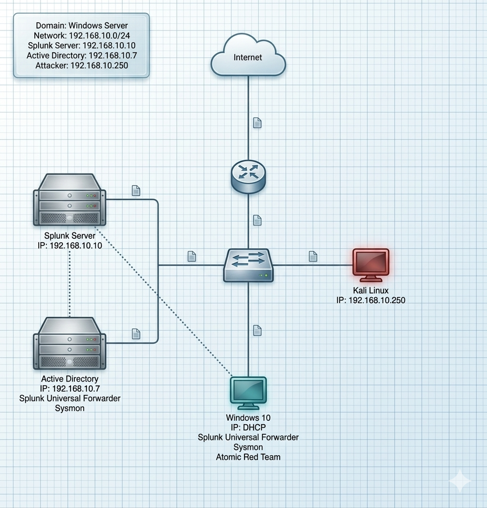
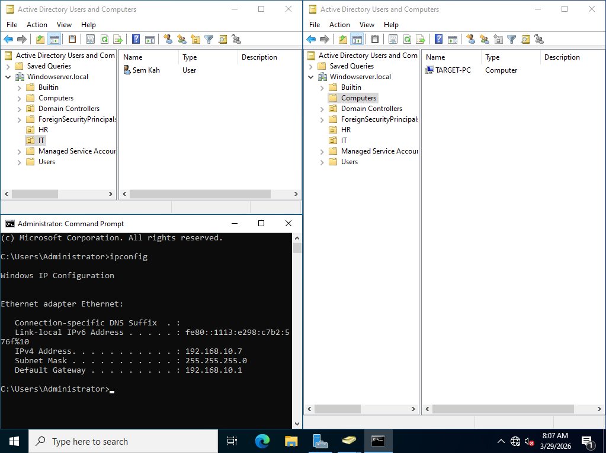
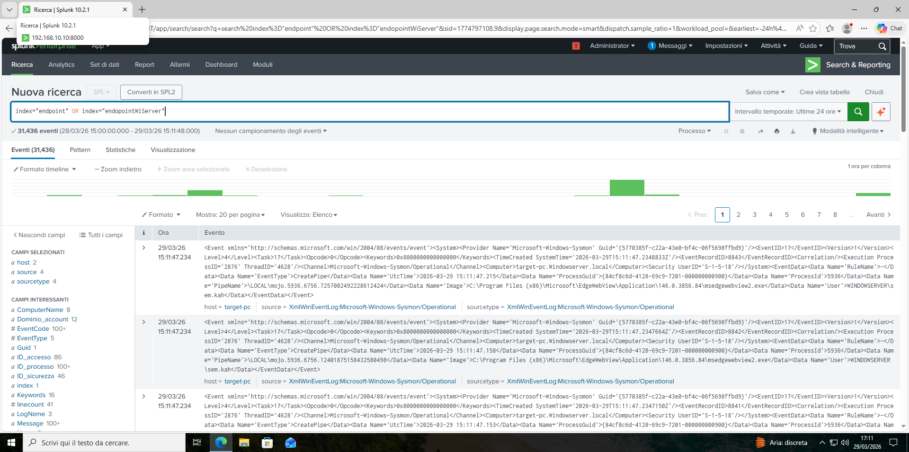
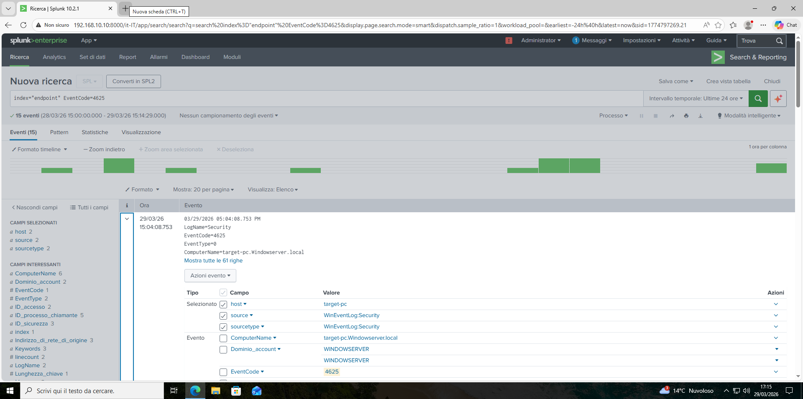
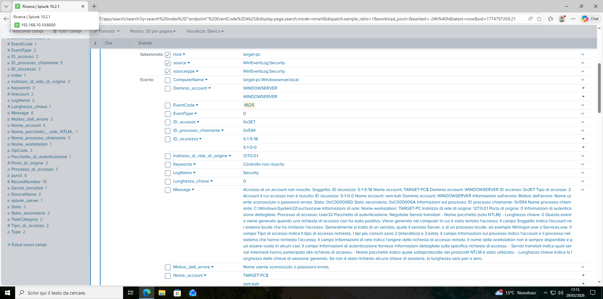
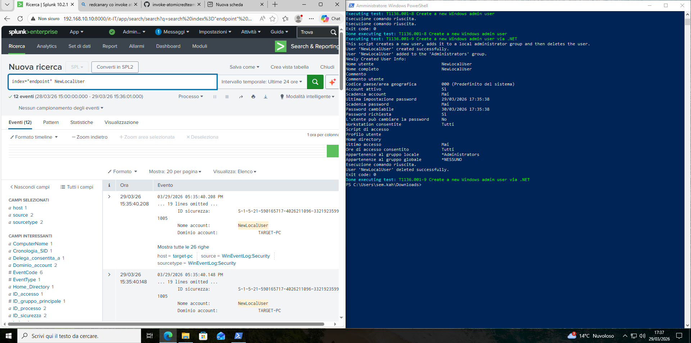
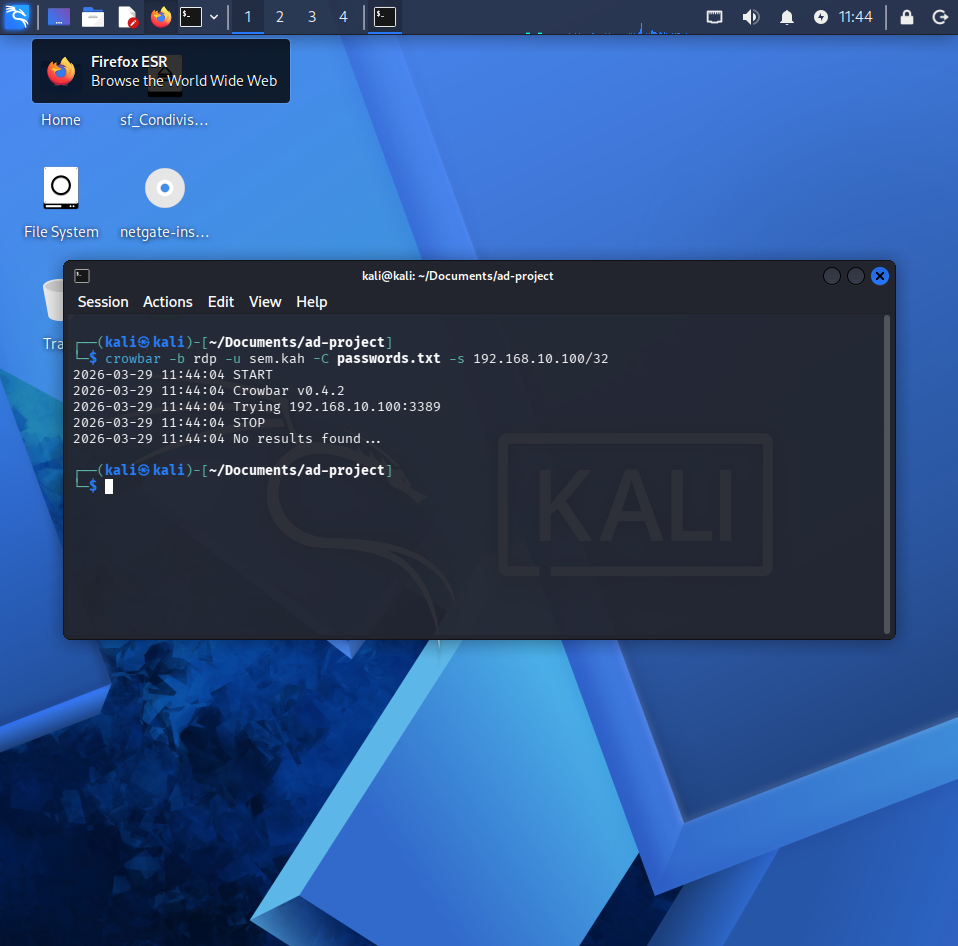

# 🛡️ Active Directory Home Lab — Ambiente di Detection & Response

> Ambiente di dominio on-premise costruito da zero, che integra Active Directory, Splunk SIEM e simulazione di attacchi per replicare i flussi di lavoro reali di un SOC.

---

## 📌 Obiettivo

Progettare e implementare un home lab completo che simula una piccola rete aziendale, acquisendo esperienza pratica su:
- Amministrazione di Active Directory
- Gestione centralizzata dei log con Splunk
- Raccolta di telemetria dagli endpoint con Sysmon
- Simulazione di attacchi e rilevamento delle minacce

---

## 🏗️ Architettura

| Macchina | Ruolo | OS | IP |
|---|---|---|---|
| AD Server | Domain Controller | Windows Server | 192.168.10.7 |
| Splunk Server | SIEM | Ubuntu Server | 192.168.10.10 |
| Target Machine | Endpoint vittima | Windows 10 | DHCP |
| Attacker Machine | Simulazione offensiva | Kali Linux | 192.168.10.250 |

**Dominio:** `mydfir.local` — **Rete:** `192.168.10.0/24`

---

## 📋 Fasi del Progetto

**Parte 1 — Progettazione**
Definita la topologia di rete e i flussi di dati tramite draw.io prima di toccare qualsiasi macchina.

**Parte 2 — Installazione**
Deploy delle quattro VM in VirtualBox su una NAT Network dedicata per l'isolamento e la comunicazione inter-VM.

**Parte 3 — Configurazione**
Active Directory promosso a Domain Controller. Splunk configurato per ricevere log sulla porta 9997. Splunk Universal Forwarder e Sysmon installati su entrambi gli endpoint Windows.

**Parte 4 — Simulazione e Detection**
Attacchi simulati da Kali Linux (brute force, credential attacks) e tramite Atomic Red Team con tecniche mappate su MITRE ATT&CK. Rilevamento verificato su Splunk tramite correlazione di Event ID e telemetria Sysmon.

---

## 📸 Screenshot

### Diagramma di rete (draw.io)

### Active Directory — Utenti e Computer

### Splunk — Log in ingresso dagli endpoint

### Splunk — Rilevamento brute force (Event ID 4625)

### Sysmon — Telemetria processo in Splunk

### Kali Linux — Simulazione attacco

---

## 🧠 Competenze Acquisite

**Networking & Virtualizzazione**
Progettazione subnet, indirizzamento IP, configurazione reti virtuali in VirtualBox.

**Active Directory**
Deploy Domain Controller, gestione OU, utenti, gruppi e Group Policy.

**SIEM & Log Management**
Installazione e configurazione Splunk Enterprise, scrittura query SPL, correlazione log da più sorgenti.

**Endpoint Security**
Deploy Sysmon con ruleset community (SwiftOnSecurity), conoscenza Event ID Windows (4624, 4625, 4688), configurazione Splunk Universal Forwarder.

**Sicurezza Offensiva**
Utilizzo di Kali Linux e Atomic Red Team per simulare tecniche MITRE ATT&CK e migliorare la logica di detection.

---

## 🛠️ Stack Tecnologico

`VirtualBox` `Windows Server` `Windows 10` `Ubuntu Server` `Kali Linux`  
`Splunk Enterprise` `Splunk Universal Forwarder` `Sysmon` `Atomic Red Team` `draw.io`

---
